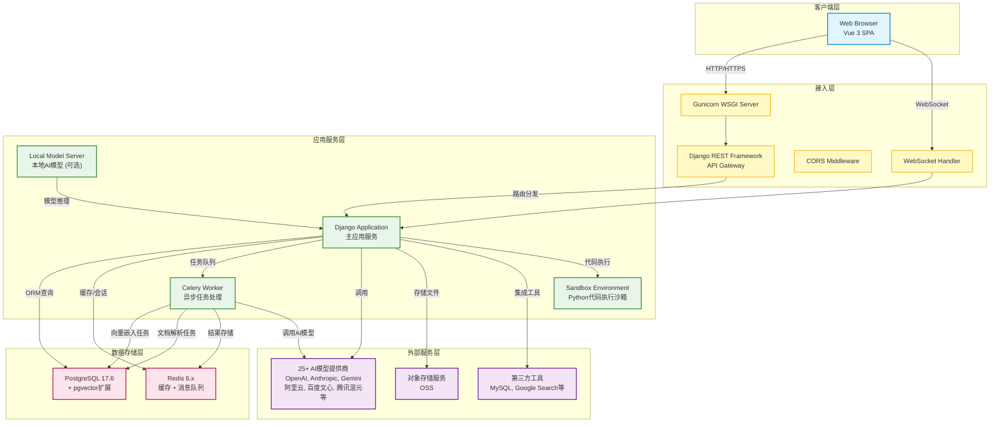

# MaxKB2 (Porsche AI) 项目架构文档

## 项目概述

**MaxKB2 (Porsche AI)** 是一个强大易用的开源企业级智能体平台,版本 2.0.0。该平台采用前后端分离架构,支持 25+ AI 模型提供商,具备可视化工作流引擎、知识库管理、RAG (检索增强生成) 等核心功能。

### 技术栈概览

**后端:**
- Django 5.2.8 + Django REST Framework
- PostgreSQL 17.6 + pgvector (向量数据库)
- Redis 6.x (缓存 + 消息队列)
- Celery 5.5.3 (异步任务处理)
- LangChain 0.3.x + LangGraph 0.5.3 (AI 编排)

**前端:**
- Vue 3.5.13 (Composition API + `<script setup>`)
- Vite 6.2.4 (构建工具)
- Element Plus 2.11.7 (UI 组件库)
- Pinia 3.0.1 (状态管理)
- LogicFlow 1.2.27 (工作流可视化编辑器)

---

## 架构图

### 1. 系统架构总览图



**架构说明:**

- **客户端层**: Vue 3 单页应用 (SPA),通过浏览器访问
- **接入层**: Gunicorn WSGI 服务器处理 HTTP 请求,Django REST Framework 提供 API 网关功能,支持 CORS 跨域和 WebSocket 实时通信
- **应用服务层**:
  - Django Application: 主应用服务,处理业务逻辑
  - Celery Worker: 异步任务处理器,负责文档解析、向量化等耗时操作
  - Local Model Server: 可选的本地 AI 模型服务
  - Sandbox: Python 代码执行沙箱,提供安全的代码执行环境
- **数据存储层**: PostgreSQL 17.6 配合 pgvector 扩展同时支持关系型数据和向量存储,Redis 提供缓存和消息队列功能
- **外部服务层**: 集成 25+ AI 模型提供商、对象存储服务和第三方工具

---

### 2. 后端分层架构图

```mermaid
graph TB
    subgraph URL["URL路由层"]
        AdminAPI["Admin API<br/>/admin/api/*"]
        ChatAPI["Chat API<br/>/chat/api/*"]
    end

    subgraph Views["视图层 (Views)"]
        AppViews["Application Views<br/>应用管理"]
        KnowledgeViews["Knowledge Views<br/>知识库管理"]
        ModelViews["Model Provider Views<br/>模型管理"]
        ChatViews["Chat Views<br/>聊天功能"]
        UserViews["User Views<br/>用户管理"]
        ToolViews["Tool Views<br/>工具管理"]
        SystemViews["System Views<br/>系统管理"]
    end

    subgraph Serializers["序列化层"]
        AppSerializers["Application Serializers"]
        KnowledgeSerializers["Knowledge Serializers"]
        ModelSerializers["Model Serializers"]
    end

    subgraph BusinessLogic["业务逻辑层"]
        direction TB

        subgraph ApplicationModule["application模块"]
            WorkflowEngine["Workflow Engine<br/>工作流引擎<br/>37种节点类型"]
            ChatPipeline["Chat Pipeline<br/>聊天管道"]
            FlowNodes["Flow Nodes<br/>AI节点/知识节点<br/>工具节点/控制节点"]
        end

        subgraph KnowledgeModule["knowledge模块"]
            VectorDB["PG Vector<br/>向量数据库"]
            DocParser["Document Parser<br/>文档解析器"]
            TextSplitter["Text Splitter<br/>文本分割器"]
            EmbeddingTask["Embedding Task<br/>向量化任务"]
        end

        subgraph ModelProvider["models_provider模块"]
            OpenAIProvider["OpenAI Provider"]
            AnthropicProvider["Anthropic Provider"]
            AliyunProvider["阿里云百炼"]
            OtherProviders["其他22+提供商"]
            BaseModel["Base Model Provider<br/>抽象基类"]
        end

        subgraph CommonModule["common模块"]
            Auth["Authentication<br/>认证授权"]
            Middleware["Middleware<br/>中间件"]
            Utils["Utils<br/>工具函数"]
            EventListener["Event Listener<br/>事件监听"]
        end
    end

    subgraph Models["数据模型层 (Models)"]
        AppModels["Application Models<br/>Application<br/>ApplicationFolder<br/>ChatRecord"]
        KnowledgeModels["Knowledge Models<br/>Knowledge<br/>Document<br/>Paragraph"]
        UserModels["User Models<br/>User<br/>Workspace"]
        ToolModels["Tool Models"]
    end

    subgraph Database["数据库层"]
        PostgreSQL["PostgreSQL 17.6<br/>+ pgvector"]
        MPTT["MPTT树形结构"]
        JSONField["JSONField配置"]
        UUID["UUID v7主键"]
    end

    subgraph AsyncTasks["异步任务层 (Celery)"]
        CeleryBeat["Celery Beat<br/>定时任务调度"]
        CeleryWorker["Celery Worker<br/>任务执行"]
        EmbeddingJobs["Embedding Jobs<br/>向量化任务"]
        GenerateJobs["Generate Jobs<br/>问题生成"]
        SyncJobs["Sync Jobs<br/>同步任务"]
        CleanJobs["Clean Jobs<br/>清理任务"]
    end

    subgraph Cache["缓存层"]
        RedisCache["Redis Cache<br/>会话/缓存"]
        RedisBroker["Redis Broker<br/>消息队列"]
    end

    %% 数据流 - URL到Views
    AdminAPI --> AppViews
    AdminAPI --> KnowledgeViews
    AdminAPI --> ModelViews
    AdminAPI --> UserViews
    AdminAPI --> ToolViews
    AdminAPI --> SystemViews
    ChatAPI --> ChatViews

    %% Views到Serializers
    AppViews --> AppSerializers
    KnowledgeViews --> KnowledgeSerializers
    ModelViews --> ModelSerializers

    %% Serializers到BusinessLogic
    AppSerializers --> WorkflowEngine
    AppSerializers --> ChatPipeline
    KnowledgeSerializers --> VectorDB
    KnowledgeSerializers --> DocParser
    ModelSerializers --> BaseModel

    %% BusinessLogic内部流转
    WorkflowEngine --> FlowNodes
    DocParser --> TextSplitter
    TextSplitter --> EmbeddingTask
    EmbeddingTask --> VectorDB

    BaseModel --> OpenAIProvider
    BaseModel --> AnthropicProvider
    BaseModel --> AliyunProvider
    BaseModel --> OtherProviders

    %% BusinessLogic到Models
    WorkflowEngine --> AppModels
    VectorDB --> KnowledgeModels
    ChatPipeline --> AppModels
    Auth --> UserModels

    %% Models到Database
    AppModels --> PostgreSQL
    KnowledgeModels --> PostgreSQL
    UserModels --> PostgreSQL
    ToolModels --> PostgreSQL

    PostgreSQL --> MPTT
    PostgreSQL --> JSONField
    PostgreSQL --> UUID

    %% 异步任务
    EmbeddingTask --> CeleryWorker
    CeleryBeat --> CeleryWorker
    CeleryWorker --> EmbeddingJobs
    CeleryWorker --> GenerateJobs
    CeleryWorker --> SyncJobs
    CeleryWorker --> CleanJobs

    EmbeddingJobs --> VectorDB
    GenerateJobs --> KnowledgeModels
    CleanJobs --> AppModels

    %% 缓存
    Auth --> RedisCache
    CeleryWorker --> RedisBroker
    RedisCache --> RedisBroker

    %% 公共组件被各模块使用
    Auth -.-> AppViews
    Auth -.-> KnowledgeViews
    Auth -.-> ModelViews
    Middleware -.-> AdminAPI
    Middleware -.-> ChatAPI
    Utils -.-> WorkflowEngine
    Utils -.-> DocParser
    EventListener -.-> ChatPipeline

    %% 样式定义
    classDef url fill:#e3f2fd,stroke:#1976d2,stroke-width:2px
    classDef views fill:#fff3e0,stroke:#f57c00,stroke-width:2px
    classDef serializers fill:#fce4ec,stroke:#c2185b,stroke-width:2px
    classDef business fill:#e8f5e9,stroke:#388e3c,stroke-width:2px
    classDef models fill:#f3e5f5,stroke:#7b1fa2,stroke-width:2px
    classDef database fill:#ffebee,stroke:#d32f2f,stroke-width:2px
    classDef async fill:#e0f2f1,stroke:#00796b,stroke-width:2px
    classDef cache fill:#fff9c4,stroke:#fbc02d,stroke-width:2px

    class AdminAPI,ChatAPI url
    class AppViews,KnowledgeViews,ModelViews,ChatViews,UserViews,ToolViews,SystemViews views
    class AppSerializers,KnowledgeSerializers,ModelSerializers serializers
    class WorkflowEngine,ChatPipeline,FlowNodes,VectorDB,DocParser,TextSplitter,EmbeddingTask,OpenAIProvider,AnthropicProvider,AliyunProvider,OtherProviders,BaseModel,Auth,Middleware,Utils,EventListener business
    class AppModels,KnowledgeModels,UserModels,ToolModels models
    class PostgreSQL,MPTT,JSONField,UUID database
    class CeleryBeat,CeleryWorker,EmbeddingJobs,GenerateJobs,SyncJobs,CleanJobs async
    class RedisCache,RedisBroker cache
```



**后端架构说明:**

#### Django 应用模块 (15+ Apps)

1. **application/** - 智能体应用管理
   - 核心模型: Application, ApplicationFolder, ChatRecord
   - 工作流引擎: 支持 37 种节点类型 (AI 节点、知识节点、工具节点、控制节点、媒体节点等)
   - 聊天管道: 管理对话流程和上下文

2. **knowledge/** - 知识库管理
   - 核心模型: Knowledge, Document, Paragraph
   - 向量数据库: PG Vector 实现向量存储和相似度搜索
   - 异步任务: 文档解析、文本分割、向量化处理

3. **models_provider/** - 模型提供者 (25+ 厂商)
   - 支持的提供商: OpenAI, Anthropic (Claude), Google Gemini, 阿里云百炼, 百度文心, 腾讯混元, 智谱, Kimi, Ollama, Xinference, vLLM, AWS Bedrock, Azure OpenAI, DeepSeek, SiliconCloud, Volcano Engine 等
   - 统一的 Provider 接口设计,易于扩展新模型

4. **chat/** - 聊天功能模块
5. **users/** - 用户管理模块
6. **system_manage/** - 系统管理 (日志、权限、设置)
7. **tools/** - 工具管理 (MySQL, PostgreSQL, Google Search 等)
8. **common/** - 公共组件 (认证、中间件、工具函数、事件监听)
9. **oss/** - 对象存储
10. **folders/** - 文件夹管理 (MPTT 树形结构)
11. **local_model/** - 本地模型管理

#### 核心流程

- **请求流程**: URL Router → View → Serializer → Business Logic → Model → Database
- **工作流执行**: Workflow Manage → Node Executor (线程池并发执行)
- **异步任务**: Celery Beat (定时调度) → Celery Worker (任务执行) → Task Handler → Result

#### 数据库特性

- 使用 UUID v7 作为主键,兼顾性能和排序
- MPTT (Modified Preorder Tree Traversal) 实现高效的树形结构查询
- JSONField 存储灵活的配置信息
- pgvector 扩展支持向量相似度搜索 (ANN)

---

### 3. 前端架构图

```mermaid
graph TB
    subgraph Build["构建层"]
        Vite["Vite 6.2.4<br/>构建工具"]
        TypeScript["TypeScript 5.8<br/>类型检查"]
        SCSS["Sass/SCSS<br/>样式预处理"]
        AdminBuild["管理模式构建<br/>npm run build → /admin/"]
        ChatBuild["聊天模式构建<br/>npm run build-chat → /chat/"]
    end

    subgraph Entry["入口层"]
        MainTS["main.ts<br/>应用入口"]
        AppVue["App.vue<br/>根组件"]
    end

    subgraph Router["路由层 (Vue Router 4.5.0)"]
        RouterIndex["router/index.ts<br/>路由配置"]
        RouteModules["Route Modules<br/>模块化路由"]
        RouteGuards["Route Guards<br/>路由守卫"]
    end

    subgraph Store["状态管理 (Pinia 3.0.1)"]
        PiniaInstance["Pinia Instance"]
        UserStore["user.ts<br/>用户状态"]
        LoginStore["login.ts<br/>登录状态"]
        AppStore["application.ts<br/>应用状态"]
        KnowledgeStore["knowledge.ts<br/>知识库状态"]
        ModelStore["model.ts<br/>模型状态"]
        ToolStore["tool.ts<br/>工具状态"]
    end

    subgraph Views["视图层 (Views - 25个模块)"]
        direction TB

        subgraph AppViews["应用管理视图"]
            AppList["Application List<br/>应用列表"]
            AppDetail["Application Detail<br/>应用详情"]
            AppWorkflow["Application Workflow<br/>工作流编辑器"]
        end

        subgraph KnowledgeViews["知识库视图"]
            KnowledgeList["Knowledge List<br/>知识库列表"]
            DocumentManage["Document Manage<br/>文档管理"]
            ParagraphManage["Paragraph Manage<br/>段落管理"]
            ProblemManage["Problem Manage<br/>问题管理"]
        end

        subgraph ChatViews["聊天视图"]
            ChatInterface["Chat Interface<br/>聊天界面"]
            ChatLog["Chat Log<br/>聊天日志"]
        end

        subgraph SystemViews["系统视图"]
            ModelManage["Model Manage<br/>模型管理"]
            ToolManage["Tool Manage<br/>工具管理"]
            SystemSetting["System Setting<br/>系统设置"]
            UserManage["User Manage<br/>用户管理"]
        end

        OtherViews["其他视图<br/>Login, Error等"]
    end

    subgraph Components["组件层 (Components - 31个)"]
        direction TB

        subgraph CoreComponents["核心组件"]
            AIChat["ai-chat/<br/>AI聊天组件"]
            Markdown["markdown/<br/>Markdown渲染"]
            FolderTree["folder-tree/<br/>文件夹树"]
            DynamicForm["dynamics-form/<br/>动态表单"]
        end

        subgraph WorkflowComponents["工作流组件"]
            WorkflowMenu["workflow-dropdown-menu/<br/>工作流菜单"]
            NodeComponents["Node Components<br/>42种节点组件"]
        end

        subgraph UIComponents["UI组件"]
            ElementPlus["Element Plus 2.11.7<br/>UI组件库"]
            CustomUI["Custom UI Components<br/>自定义UI组件"]
        end
    end

    subgraph Workflow["工作流编辑器 (LogicFlow 1.2.27)"]
        LFCore["LogicFlow Core<br/>核心引擎"]
        LFExtension["LogicFlow Extension<br/>扩展插件"]
        NodeIcons["Node Icons<br/>节点图标"]
        LFPlugins["LF Plugins<br/>插件"]
    end

    subgraph API["API层 (Axios 1.8.4)"]
        AxiosInstance["Axios Instance<br/>HTTP客户端实例"]
        RequestInterceptor["Request Interceptor<br/>请求拦截器"]
        ResponseInterceptor["Response Interceptor<br/>响应拦截器"]

        APIModules["API Modules"]
        AppAPI["application/<br/>应用API"]
        KnowledgeAPI["knowledge/<br/>知识库API"]
        ModelAPI["model/<br/>模型API"]
        ToolAPI["tool/<br/>工具API"]
        SystemAPI["system/<br/>系统API"]
        ChatAPI["chat/<br/>聊天API"]
    end

    subgraph Types["类型定义"]
        TypeDefinitions["Type Definitions<br/>TypeScript类型"]
        APIType["api/type/<br/>API类型定义"]
    end

    subgraph Utils["工具层"]
        CommonUtils["Common Utils<br/>通用工具函数"]
        DateUtils["Date Utils<br/>日期工具"]
        StorageUtils["Storage Utils<br/>存储工具"]
        ValidateUtils["Validate Utils<br/>验证工具"]
    end

    subgraph I18n["国际化 (Vue I18n 11.1.3)"]
        I18nInstance["Vue I18n Instance"]
        ZHLocale["zh-CN<br/>简体中文"]
        ZHTLocale["zh-Hant<br/>繁体中文"]
        ENLocale["en-US<br/>英文"]
    end

    subgraph Features["特性组件"]
        Mermaid["Mermaid 11.12.0<br/>图表渲染"]
        KaTeX["KaTeX 0.16.10<br/>数学公式"]
        CodeMirror["CodeMirror 6<br/>代码编辑器"]
        ECharts["ECharts 5.6.0<br/>数据可视化"]
        MdEditor["md-editor-v3 5.8.2<br/>Markdown编辑器"]
    end

    %% 数据流
    Vite --> AdminBuild
    Vite --> ChatBuild
    TypeScript --> AdminBuild
    TypeScript --> ChatBuild
    SCSS --> AdminBuild
    SCSS --> ChatBuild

    AdminBuild --> MainTS
    ChatBuild --> MainTS
    MainTS --> AppVue

    AppVue --> RouterIndex
    RouterIndex --> RouteModules
    RouterIndex --> RouteGuards

    AppVue --> PiniaInstance
    PiniaInstance --> UserStore
    PiniaInstance --> LoginStore
    PiniaInstance --> AppStore
    PiniaInstance --> KnowledgeStore
    PiniaInstance --> ModelStore
    PiniaInstance --> ToolStore

    RouteModules --> AppList
    RouteModules --> AppDetail
    RouteModules --> AppWorkflow
    RouteModules --> KnowledgeList
    RouteModules --> DocumentManage
    RouteModules --> ParagraphManage
    RouteModules --> ProblemManage
    RouteModules --> ChatInterface
    RouteModules --> ChatLog
    RouteModules --> ModelManage
    RouteModules --> ToolManage
    RouteModules --> SystemSetting
    RouteModules --> UserManage
    RouteModules --> OtherViews

    %% Views使用Components
    AppList --> ElementPlus
    AppDetail --> ElementPlus
    AppWorkflow --> WorkflowMenu
    AppWorkflow --> NodeComponents
    AppWorkflow --> LFCore
    ChatInterface --> AIChat
    ChatInterface --> Markdown
    KnowledgeList --> FolderTree
    DocumentManage --> DynamicForm
    ProblemManage --> DynamicForm

    %% Workflow编辑器
    LFCore --> LFExtension
    LFCore --> NodeIcons
    LFCore --> LFPlugins
    NodeComponents --> LFCore

    %% Components使用API
    AIChat --> AxiosInstance
    AppList --> AxiosInstance
    KnowledgeList --> AxiosInstance
    ModelManage --> AxiosInstance

    %% API层
    AxiosInstance --> RequestInterceptor
    AxiosInstance --> ResponseInterceptor
    RequestInterceptor --> AppAPI
    RequestInterceptor --> KnowledgeAPI
    RequestInterceptor --> ModelAPI
    RequestInterceptor --> ToolAPI
    RequestInterceptor --> SystemAPI
    RequestInterceptor --> ChatAPI

    AppAPI --> APIModules
    KnowledgeAPI --> APIModules
    ModelAPI --> APIModules
    ToolAPI --> APIModules
    SystemAPI --> APIModules
    ChatAPI --> APIModules

    %% API使用Types
    AppAPI --> APIType
    KnowledgeAPI --> APIType
    ModelAPI --> APIType

    %% Stores使用API
    UserStore --> AppAPI
    LoginStore --> SystemAPI
    AppStore --> AppAPI
    KnowledgeStore --> KnowledgeAPI
    ModelStore --> ModelAPI
    ToolStore --> ToolAPI

    %% 国际化
    I18nInstance --> ZHLocale
    I18nInstance --> ZHTLocale
    I18nInstance --> ENLocale
    AppVue -.-> I18nInstance

    %% 工具函数被各层使用
    CommonUtils -.-> Views
    CommonUtils -.-> Components
    CommonUtils -.-> API
    CommonUtils -.-> Store

    %% 特性组件被Views使用
    Markdown --> Mermaid
    Markdown --> KaTeX
    DocumentManage --> CodeMirror
    SystemSetting --> ECharts
    ParagraphManage --> MdEditor

    %% 样式定义
    classDef build fill:#e3f2fd,stroke:#1976d2,stroke-width:2px
    classDef entry fill:#fff3e0,stroke:#f57c00,stroke-width:2px
    classDef router fill:#fce4ec,stroke:#c2185b,stroke-width:2px
    classDef store fill:#e8f5e9,stroke:#388e3c,stroke-width:2px
    classDef views fill:#f3e5f5,stroke:#7b1fa2,stroke-width:2px
    classDef components fill:#ffebee,stroke:#d32f2f,stroke-width:2px
    classDef workflow fill:#e0f2f1,stroke:#00796b,stroke-width:2px
    classDef api fill:#fff9c4,stroke:#fbc02d,stroke-width:2px
    classDef types fill:#fafafa,stroke:#616161,stroke-width:2px
    classDef utils fill:#efebe9,stroke:#5d4037,stroke-width:2px
    classDef i18n fill:#f1f8e9,stroke:#689f38,stroke-width:2px
    classDef features fill:#ede7f6,stroke:#512da8,stroke-width:2px

    class Vite,TypeScript,SCSS,AdminBuild,ChatBuild build
    class MainTS,AppVue entry
    class RouterIndex,RouteModules,RouteGuards router
    class PiniaInstance,UserStore,LoginStore,AppStore,KnowledgeStore,ModelStore,ToolStore store
    class AppList,AppDetail,AppWorkflow,KnowledgeList,DocumentManage,ParagraphManage,ProblemManage,ChatInterface,ChatLog,ModelManage,ToolManage,SystemSetting,UserManage,OtherViews views
    class AIChat,Markdown,FolderTree,DynamicForm,WorkflowMenu,NodeComponents,ElementPlus,CustomUI components
    class LFCore,LFExtension,NodeIcons,LFPlugins workflow
    class AxiosInstance,RequestInterceptor,ResponseInterceptor,AppAPI,KnowledgeAPI,ModelAPI,ToolAPI,SystemAPI,ChatAPI,APIModules api
    class TypeDefinitions,APIType types
    class CommonUtils,DateUtils,StorageUtils,ValidateUtils utils
    class I18nInstance,ZHLocale,ZHTLocale,ENLocale i18n
    class Mermaid,KaTeX,CodeMirror,ECharts,MdEditor features
```



**前端架构说明:**

#### 技术栈

- **Vue 3.5.13**: 采用 Composition API 和 `<script setup>` 语法
- **Vite 6.2.4**: 快速的构建工具和开发服务器
- **Element Plus 2.11.7**: 企业级 UI 组件库
- **Pinia 3.0.1**: 轻量级状态管理
- **Vue Router 4.5.0**: 官方路由管理器
- **LogicFlow 1.2.27**: 流程图编辑引擎
- **Axios 1.8.4**: HTTP 客户端
- **TypeScript 5.8**: 类型安全

#### 目录结构

```
ui/src/
├── views/                # 页面视图 (25个模块)
│   ├── application/      # 应用管理
│   ├── application-workflow/  # 工作流编辑器
│   ├── knowledge/        # 知识库管理
│   ├── document/         # 文档管理
│   ├── paragraph/        # 段落管理
│   ├── problem/          # 问题管理
│   ├── chat/             # 聊天界面
│   ├── chat-log/         # 聊天日志
│   ├── model/            # 模型管理
│   ├── tool/             # 工具管理
│   ├── system/           # 系统管理
│   └── ...
├── components/           # 可复用组件 (31个)
│   ├── ai-chat/          # AI 聊天组件
│   ├── markdown/         # Markdown 渲染
│   ├── workflow-dropdown-menu/
│   ├── folder-tree/
│   └── dynamics-form/
├── api/                  # API 调用封装
│   ├── application/
│   ├── knowledge/
│   ├── model/
│   ├── tool/
│   ├── system/
│   └── type/             # TypeScript 类型定义
├── stores/               # Pinia 状态管理
│   ├── modules/
│   │   ├── user.ts
│   │   ├── login.ts
│   │   ├── application.ts
│   │   ├── knowledge.ts
│   │   └── model.ts
├── router/               # 路由配置
│   └── modules/          # 模块化路由
├── workflow/             # 工作流编辑器
│   ├── nodes/            # 节点组件 (42种)
│   ├── icons/
│   └── plugins/
└── locales/              # 国际化 (zh, zh_Hant, en)
```

#### 双模式构建

- **管理模式**: `npm run build` → 输出到 `/admin/` 目录,包含完整的管理功能
- **聊天模式**: `npm run build-chat` → 输出到 `/chat/` 目录,仅包含聊天功能,体积更小

#### 工作流编辑器

基于 LogicFlow 实现的可视化工作流编辑器,支持 42 种节点组件的拖拽编排,包括:
- 基础节点: 开始节点、问题节点、直接回复节点
- AI 节点: AI 聊天节点、意图识别节点、参数提取节点
- 知识节点: 知识库检索节点、知识写入节点、重排序节点
- 工具节点: 工具调用节点、MCP 节点
- 控制节点: 条件分支节点、循环节点
- 媒体节点: 图像生成节点、语音合成节点、语音识别节点

---

## 关键技术特性

### 1. RAG 架构 (检索增强生成)

```
知识库 → 文档上传 → 文档解析 → 文本分割 → 向量化 (Embedding) → PG Vector 存储
                                                    ↓
用户提问 → 问题向量化 → 相似度检索 → 检索结果增强 → LLM 生成回答
```

- **文档解析**: 支持 PDF、Word、Excel、PPT、HTML、Markdown、TXT 等多种格式
- **文本分割**: 智能分段,保持语义完整性
- **向量化**: 使用 Embedding 模型将文本转换为向量
- **相似度检索**: 基于 pgvector 的 ANN (近似最近邻) 搜索
- **检索增强**: 将检索到的相关知识片段注入 prompt,提升 LLM 回答质量

### 2. 工作流引擎

- **37 种节点类型**: 覆盖 AI 调用、知识检索、工具集成、流程控制、媒体处理等场景
- **可视化编排**: 拖拽式工作流编辑器,无需编码即可构建复杂业务逻辑
- **并发执行**: 基于线程池的节点并行执行,提升性能
- **状态管理**: 支持变量赋值、聚合、拆分,实现节点间数据传递
- **多语言支持**: 工作流模板支持中文简体、繁体、英文

### 3. 多模型适配 (Provider 模式)

- **统一接口**: 通过 Base Model Provider 抽象层,统一不同厂商的 API 调用方式
- **25+ 模型提供商**:
  - 国际: OpenAI (GPT), Anthropic (Claude), Google (Gemini), AWS Bedrock, Azure OpenAI
  - 国内: 阿里云百炼、百度文心、腾讯混元、智谱、Kimi、DeepSeek、火山引擎等
  - 本地部署: Ollama、Xinference、vLLM、Regolo
- **灵活切换**: 运行时可动态切换模型,无需修改代码
- **易于扩展**: 新增模型提供商只需实现 Provider 接口

### 4. 异步任务处理

- **Celery + Redis**: 分布式任务队列,处理耗时操作
- **典型任务**:
  - Embedding Jobs: 文档向量化
  - Generate Jobs: 自动生成相关问题
  - Sync Jobs: 数据同步 (如飞书、语雀)
  - Clean Jobs: 定期清理过期会话和临时文件
- **定时调度**: Celery Beat 支持 cron 表达式定时执行
- **重试机制**: 任务失败自动重试,提高可靠性

### 5. 沙箱安全

- **Python 代码执行沙箱**: 隔离用户自定义代码的执行环境
- **网络访问限制**: 禁止访问内网地址和敏感域名
- **文件系统隔离**: 限制文件读写范围
- **资源限制**: 控制 CPU 和内存使用

### 6. 多租户支持

- **工作空间 (Workspace)**: 资源和权限的逻辑隔离单元
- **用户角色**: 管理员、普通成员等不同权限级别
- **资源授权**: 细粒度的知识库、应用等资源访问控制

---

## 部署架构

### Docker 镜像

1. **porsche-vector-model:v1.0.1**: 向量模型镜像,预置 Embedding 模型
2. **Dockerfile-base**: 基础镜像
   - Python 3.11-slim
   - PostgreSQL 17.6 + pgvector + AGE
   - Redis Server
   - FFmpeg
   - Sandbox 环境
3. **Dockerfile-sdlc**: SDLC 镜像
4. **Dockerfile-vector-model**: 向量模型专用镜像

### 服务组件

- **PostgreSQL**: 主数据库 + 向量存储
- **Redis**: 缓存 + Celery Broker
- **Gunicorn**: WSGI 服务器
- **Celery Worker**: 异步任务处理
- **Local Model Server**: 本地模型服务 (可选)

### 启动命令

```bash
# 启动所有服务 (守护进程)
python main.py start all -d

# 开发模式启动 Web
python main.py dev web

# 开发模式启动 Celery
python main.py dev celery

# 数据库迁移
python main.py upgrade_db

# 收集静态文件
python main.py collect_static
```

---

## 代码统计

- **Python 文件**: ~910 个
- **Vue 组件**: ~419 个
- **TypeScript 文件**: ~289 个
- **后端模块**: 15+ 个 Django App
- **前端视图模块**: 25+ 个
- **可复用组件**: 31+ 个
- **工作流节点**: 37+ 种
- **AI 模型提供商**: 25+ 个

---

## 总结

MaxKB2 (Porsche AI) 采用现代化的前后端分离架构,具有以下特点:

1. **微服务化单体**: 虽然采用单体 Django 应用,但模块划分清晰,易于维护和扩展
2. **插件化模型层**: Provider 模式支持 25+ AI 模型,降低厂商锁定风险
3. **可视化工作流**: 拖拽式工作流编辑器,降低使用门槛
4. **向量检索增强**: PostgreSQL + pgvector 实现高效的 RAG 架构
5. **异步任务处理**: Celery + Redis 保障系统响应性能
6. **多租户支持**: 工作空间实现资源和权限隔离
7. **容器化部署**: Docker 多阶段构建,简化运维
8. **沙箱安全**: 保障用户代码执行安全
9. **国际化**: 支持中文简体、繁体、英文

该架构在灵活性、可扩展性、安全性和性能之间取得了良好平衡,适合企业级智能体应用场景。
